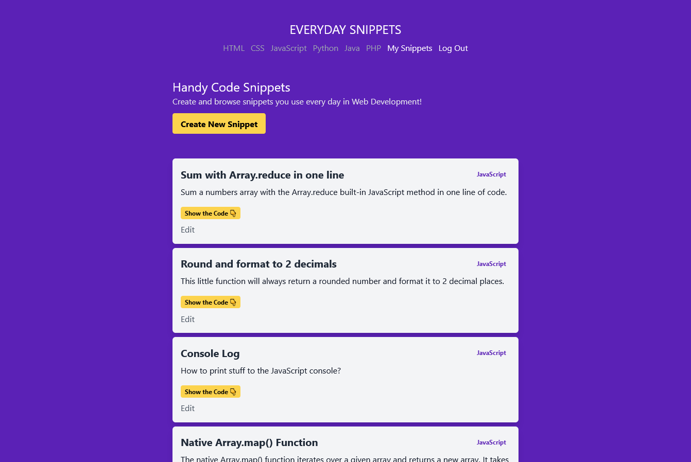

<p align="center">
  <a href="https://nextjs-blog-pied-iota.vercel.app">
    
    <h1 align="center">Next Code Snippets</h1>
  </a>
</p>

> Next.js / FaunaDB / Auth0 / Tailwind CSS

A fun and easy to use Next.js web app that let's you save your everyday code snippets.

------

## Main Features

- Hybrid pages featuring both `Static & Server Side Rendering` and `SEO`
- SEO friendly URLs and content
- User authentication with Auth0
- Protected routes using Auth0 hooks
- Realtime Data and CRUD app with FaunaDB
- Save and Sort snippets by categories

## Cloning this repo

Be sure to create a Fauna and Auth0 accounts before cloning this repo as you'll need to create a `.env.local` file and add the correct API Keys for your project to work properly.

```bash
git clone https://github.com/luvagu/next-code-snippets.git

cd next-code-snippets

npm install

npm run dev
```

## Live Demo

Try the live demo at: 
